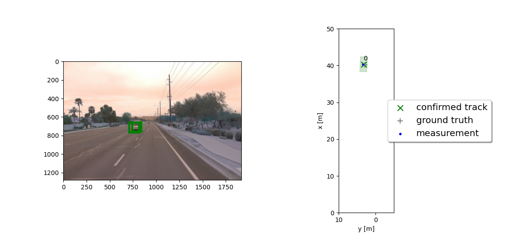
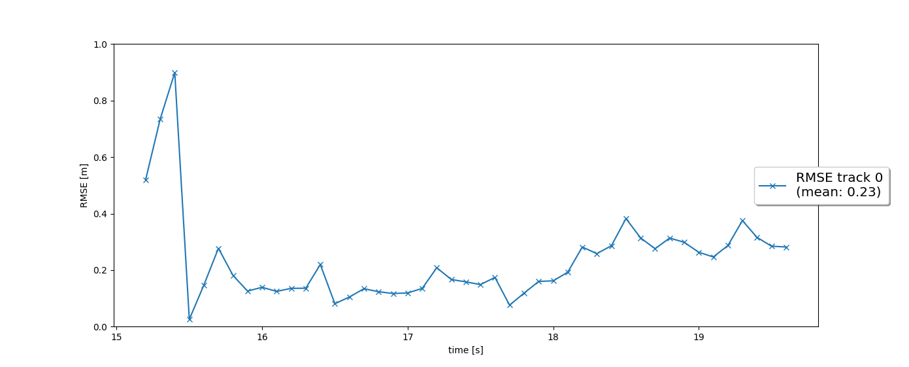
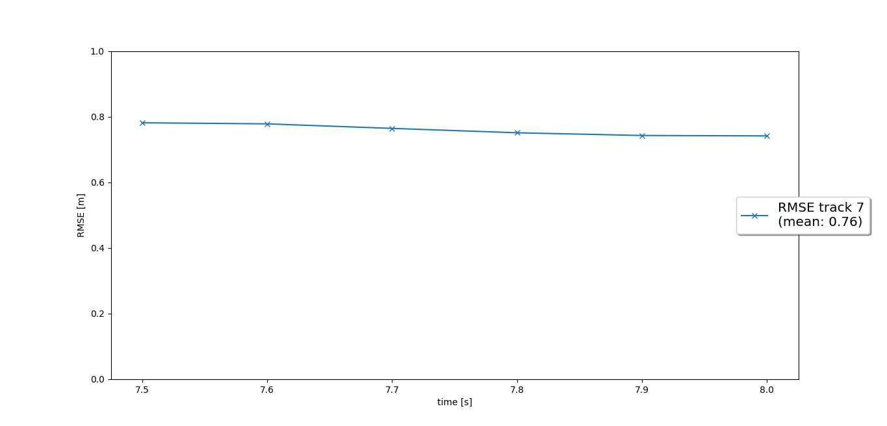
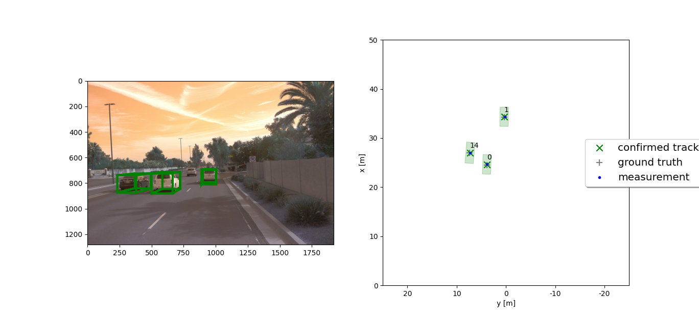
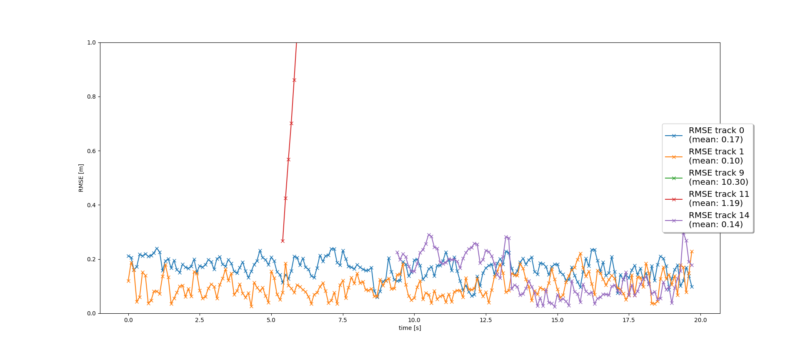
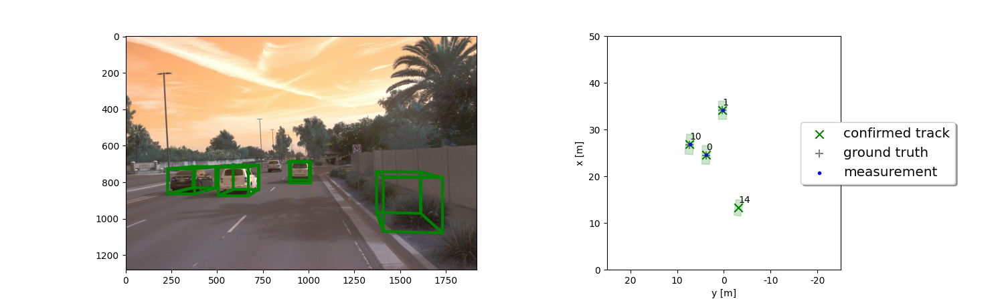

# Project 2: Sensor Fusion and Object Detection

- Write a short recap of the four tracking steps and what you implemented there (EKF, track management, data association, camera-lidar sensor fusion). Which results did you achieve? Which part of the project was most difficult for you to complete, and why?
- Do you see any benefits in camera-lidar fusion compared to lidar-only tracking (in theory and in your concrete results)?
- Which challenges will a sensor fusion system face in real-life scenarios? Did you see any of these challenges in the project?
- Can you think of ways to improve your tracking results in the future?

## Step 1: Extended Kalman Filter `filter.py` 

In this step, a standard extended kalman filter is implemented using the measurements from a 3D lidar detection. This filter uses a kinematic model to predict the detected objects. The state prediction and update is implemented with covariance matrices and time step (.1s) as provided in `misc/params.py`.
Shown below is a visualization of EKF on one the Waymo Datasets. 

*(Left) Camera output with bounding box predicted by EKF. (Right) Tracking in BEV* 

*RMSE plot for prediction error with respect to ground truth*

## Step 2: Track management `track_management.py` 

In this step, the track management algorithm is implemented. Each unassigned measurement is initilized as track. If that measurement continues to match with prediction, the tracking score is increases until 1. Once the score reaches a minimum threshold, the track confirms the location of object and if the score drops below another threshold, it gets deleted, otherwise it is kept as tentative. 

*RMSE plot for prediction error with respect to ground truth*

Clearly there is a large RMSE, describing a poor performance. This can be because the object is moving relatively fast through the frames and the Prediction is not able to track it properly.

## Step 3: Track association `association.py`

In this step, the algorithm makes sure that with each new timestep, different tracks are associated with their respective ground truth. This step only uses the lidar measurements.

*(Left) Camera output with bounding box predicted by EKF. (Right) Tracking in BEV* 

*RMSE plot for prediction error with respect to ground truth*

*The tracking shows a ghost output *

## Step 4:
Video Submission for final tracking

*(Left) Camera output with bounding box predicted by EKF. (Right) Tracking in BEV* 

*RMSE plot for prediction error with respect to ground truth*

https://user-images.githubusercontent.com/16174913/222013937-a4127b27-73b4-4d0d-b7bd-a4fbe98e62d8.mp4

