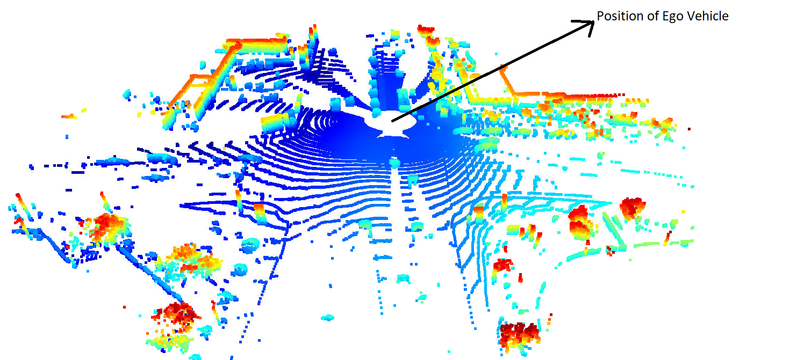

# Mid Term Project - 3D Object Detection
Author : Shreyansh Shethia 

In this project, the LiDAR measurements are transformed into range and height images with a birds-eye-view angle. Then an off-the-shelf CNN model is used to classify the objects in those images into car, pedestrians, and cyclists. The real-world data from the Waymo Open Dataset is used.

### ID S1 EX1

*Upper Image is the range and lower image shows intensity*

### ID S1 EX2

In this exrcise, the lidar point cloud datapoint are visualized.
The closer points are blue in color and farther points are red in color.

Following  video shows the point clouds being captured at different time stamps.

In the images, the flow of cars and their respective shadows show that the ego vehicle is moving from left to right in the bev.

