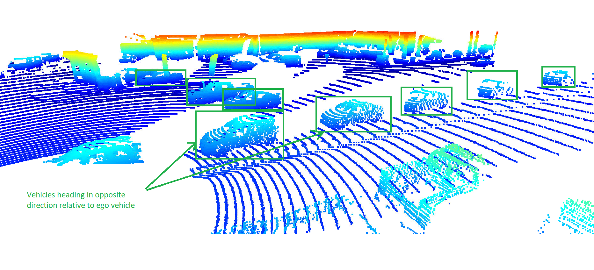
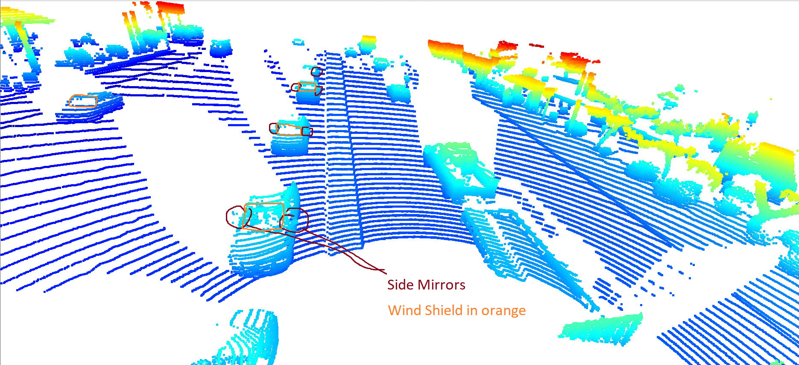

# Mid Term Project - 3D Object Detection
Author : Shreyansh Shethia 

In this project, the LiDAR measurements are transformed into range and height images with a birds-eye-view angle. Then an off-the-shelf CNN model is used to classify the objects in those images into car, pedestrians, and cyclists. The real-world data from the Waymo Open Dataset is used.

### ID S1 EX1

*Upper Image is the range and lower image shows intensity*

### ID S1 EX2

In this exrcise, the lidar point cloud datapoint are visualized.
The closer points are blue in color and farther points are red in color.

Following  video shows the point clouds being captured at different time stamps.

In the images, the flow of cars and their respective shadows show that the ego vehicle is moving from left to right in the bev.

Below shows the vehicles at different locations and their visibility.

* Clear visibility of vehicle moving in opposite direction. Vehicles farther from our sensor have low number of datapoints and less obvious features. apart from front bonnet, side doors are also obsevred. 

* Rear vehicles trailing behind the ego vehile shows only the windsield and bonnet.

* Some vehicles are visbile to be at a perpendicular direction as compared to our vehicle

* When any other vehicle gets too close, it gets out of FOV

* This shows a vehicle being occluded by other vehicle

* Looks like a pick-up Truck and a Trailer

 - Below shows a few identifiable feature of a car in the images 

* Side mirrors and Front Windshield 

* Side doors and windows, rear bumper, tires, front bonnet is visible  

### 

